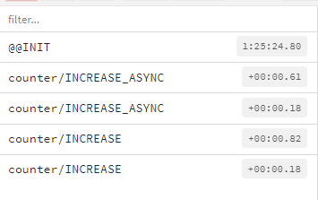
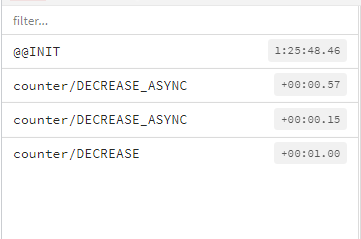

# 18. 리덕스 미들웨어를 통한 비동기 작업 관리
리액트 웹 애플리케이션에서 API서버를 연동할 때 API 요청에 대한 상태 관리를 해야한다. 요청 시작시 로딩중임을 요청 성공, 실패시 로딩이 끝났음을 응답에 대한 상태, 실패시 에러에 대한 상태 등을 관리해야 한다.

## 18.1 작업 환경 준비
`yarn add redux react-redux redux-actions` 필요한 라이브러리 다운로드
```javascript
// src/modules/counter.js
import {createAction, handleActions, hanldleActions} from 'redux-actions';

const INCREASE = 'counter/INCREASE';
const DECREASE = 'counter/DECREASE';

export const increase = createAction(INCREASE);
export const decrease = createAction(DECREASE);

const initialState = 0;

const counter = handleActions(
  {
    [INCREASE]: (state) => state + 1,
    [DECREASE]: (state) => state - 1
  },
  initialState
);

export default counter;
```
```javascript
// src/modules/index.js
import {combineReducers} from 'redux';
import counter from './counter';

const rootReducer = combineReducers({
  counter
});

export default rootReducer;
```
```javascript
// src/index.js
import ReactDOM from 'react-dom';
import './index.css';
import App from './App';
import {createStore} from 'redux';
import rootReducer from './modules';
import {Provider} from 'react-redux';

const store = createStore(rootReducer);

ReactDOM.render(
  <Provider store={store}>
    <App />
  </Provider>,
  document.getElementById('root')
);
```
```javascript
// src/components/Counter.js
const Counter = ({onIncrease, onDecrease, number}) => {
  return (
    <div>
      <h1>{number}</h1>
      <button onClick={onIncrease}>+1</button>
      <button onClick={onDecrease}>-1</button>
    </div>
  );
};

export default Counter;
```
```javascript
// src/containers/CounterContainer.js
import Counter from '../components/Counter';
import {connect} from 'react-redux';
import {increase, decrease} from '../modules/counter';

const CounterContainer = ({number, increase, decrease}) => {
  return <Counter number={number} onIncrease={increase} onDecrease={decrease} />;
};

export default connect(
  (state) => ({
    number: state.counter
  }),
  {
    increase,
    decrease
  }
)(CounterContainer);
```
```javascript
// src/App.js
import CounterContainer from './containers/CounterContainer';

const App = () => {
  return (
    <div>
      <CounterContainer />
    </div>
  );
};
export default App;
```

## 18.2 미들웨어란?
리덕스 미들웨어는 액션을 디스패치했을 때 이를 처리하기 앞서 사전에 지정된 작업을 실행한다. 예) 전달받은 액션을 콘솔에 기록, 액션정보를 기반으로 액션 취소, 다른종류의 액션을 추가로 디스패치등..

```javascript
const loggerMiddleware = (store) => (next) => (action) => {
  //미들웨어 기본 구조
};
export default loggerMiddleware;
```
미들웨어는 함수를 반환하는 함수를 반환하는 함수이다.
* store : 리덕스 스토어 인스턴스
* action : 디스패치된 액션
* next : 함수 형태로 store.dispatch와 비슷한 역할을 함, next(action)을 호출하면 그다음 처리해야 할 미들웨어에게 액션을 넘겨주고, 미들웨어가 없다면 리듀서에게 액션을 넘겨준다.


미들웨어 내부에서 store.dispatch를 사용하면 첫 번째 미들웨어부터 다시 처리, 미들웨어에서 next를 사용하지 않으면 액션이 리듀서에 전달되지 않는다.

```javascript
const loggerMiddleware = (store) => (next) => (action) => {
  console.group(action && action.type); //액션 타입으로 log 그룹화
  console.log('이전상태', store.getState());
  console.log('액션', action);
  next(action); //다음 미들웨어 or 리듀서에게 전달
  console.log('다음 상태', store.getState()); //업데이트된 상태
  console.groupEnd(); //그룹 끝
};

export default loggerMiddleware;


// src/index.js
const store = createStore(rootReducer, applyMiddleware(loggerMiddleware));
```


### redux-logger 사용하기
redux-logger 미들웨어는 위 예제보다 잘 만들어진 라이브러리이다. `yarn add redux-logger` 
```javascript
// src/index.js
const logger = createLogger();
const store = createStore(rootReducer, applyMiddleware(logger));
```


## 18.3 비동기 작업을 처리하는 미들웨어 사용
### 18.3.1 redux-thunk
리덕스를 사용하는 프로젝트에서 비동기 작업을 처리할 때 가장 기본적으로 사용하는 미들웨어이다.

Thunk 란? 특정 작업을 나중에 할 수 있도록 미루기 위해 함수 형태로 감싼 것을 의미한다.
```javascript
const addOne = x => x + 1;
addOne(1);   //함수 호출시 연산이 바로 됨

function addOneThunk(x) {
  const thunk = () => addOne(x);
  return thunk;
}

const fn = addOneThunk(1);
setTimeout(() => {
  const value = fn();
  console.log(value);
}, 1000);
```

`yarn add redux-thunk` 라이브러리 다운, const store = createStore(rootReducer, applyMiddleware(logger, ReduxThunk)); 스토어 생성시 redux-thunk 적용
```javascript
// counter.js
const INCREASE = 'counter/INCREASE';
const DECREASE = 'counter/DECREASE';

export const increase = createAction(INCREASE);
export const decrease = createAction(DECREASE);

export const increaseAsync = () => (dispatch) => {
  setTimeout(() => {
    dispatch(increase());
  }, 1000);
};

export const decreaseAsync = () => (dispatch) => {
  setTimeout(() => {
    dispatch(decrease());
  }, 1000);
};

//CounterContainer.js
import Counter from '../components/Counter';
import {connect} from 'react-redux';
import {increaseAsync, decreaseAsync} from '../modules/counter';

const CounterContainer = ({number, increaseAsync, decreaseAsync}) => {
  return <Counter number={number} onIncrease={increaseAsync} onDecrease={decreaseAsync} />;
};

export default connect(
  (state) => ({
    number: state.counter
  }),
  {
    increaseAsync,
    decreaseAsync
  }
)(CounterContainer);

```

__웹 요청 비동기 작업 처리하기__
```javascript
//lib/api.js
import axios from 'axios';

export const getPost = (id) => axios.get(`https://jsonplaceholder.typicode.com/posts/${id}`);
export const getUsers = () => axios.get(`https://jsonplaceholder.typicode.com/users`);
```
```javascript
//modules/sample.js
import {handleActions} from 'redux-actions';
import * as api from '../lib/api';
import createRequestThunk from '../lib/createRequestThunk';

//1. 액션 타입 선언
const GET_POST = 'sample/GET_POST';
const GET_POST_SUCCESS = 'sample/GET_POST_SUCCESS';
//const GET_POST_FAILURE = 'sample/GET_POST_FAILURE';

const GET_USERS = 'sample/GET_USERS';
const GET_USERS_SUCCESS = 'sample/GET_USERS_SUCCESS';
//const GET_USERS_FAILURE = 'sample/GET_USERS_FAILURE';

//2. thunk 함수 생성 : 함수 내부에서는 시작시, 성공시, 실패시 다른 액션을 디스패치 한다.
export const getPost = createRequestThunk(GET_POST, api.getPost);
export const getUsers = createRequestThunk(GET_USERS, api.getUsers);

//3. 초기 상태 선언
const initialState = {
  /*
  loading: {
    GET_POST: false,
    GET_USERS: false
  },
  */
  post: null,
  user: null
};

const sample = handleActions(
  {
    // [GET_POST]: (state) => ({
    //   ...state,
    //   loading: {
    //     ...state.loading,
    //     GET_POST: true
    //   }
    // }),
    [GET_POST_SUCCESS]: (state, action) => ({
      ...state,
      // loading: {
      //   ...state.loading,
      //   GET_POST: false
      // },
      post: action.payload
    }),
    // [GET_USERS]: (state) => ({
    //   ...state,
    //   loading: {
    //     ...state.loading,
    //     GET_USERS: true
    //   }
    // }),
    [GET_USERS_SUCCESS]: (state, action) => ({
      ...state,
      // loading: {
      //   ...state.loading,
      //   GET_USERS: false
      // },
      users: action.payload
    })
  },
  initialState
);

export default sample;
```
```javascript
//modules/index.js
import {combineReducers} from 'redux';
import counter from './counter';
import sample from './sample';
import loading from './loading';

const rootReducer = combineReducers({
  counter,
  sample,
  loading
});

export default rootReducer;
```
```javascript
//components/Sample.js
const Sample = ({loadingPost, loadingUsers, post, users}) => {
  return (
    <div>
      <section>
        <h1>포스트</h1>
        {loadingPost && '로딩 중...'} {/* 데이터 렌더링시 유효성 검사를 해주는 것이 중요하다. */}
        {!loadingPost && post && (
          <div>
            <h3>{post.title}</h3>
            <h3>{post.body}</h3>
          </div>
        )}
      </section>
      <hr />
      <section>
        <h1>사용자 목록</h1>
        {loadingUsers && '로딩 중...'}
        {!loadingUsers && users && (
          <ul>
            {users.map((user) => (
              <li key={user.id}>
                {user.username} ({user.email})
              </li>
            ))}
          </ul>
        )}
      </section>
    </div>
  );
};

export default Sample;
```
```javascript
//containers/SampleContainer.js
import React from 'react';
import {connect} from 'react-redux';
import Sample from '../components/Sample';
import {getPost, getUsers} from '../modules/sample';

const {useEffect} = React;
const SampleContainer = ({getPost, getUsers, post, users, loadingPost, loadingUsers}) => {
  useEffect(() => {
    getPost(1);
    getUsers(1);
  }, [getPost, getUsers]);
  return <Sample post={post} users={users} loadingPost={loadingPost} loadingUsers={loadingUsers} />;
};

export default connect(
  ({sample, loading}) => ({
    post: sample.post,
    users: sample.users,
    loadingPost: loading['sample/GET_POST'],
    loadingUsers: loading['sample/GET_USERS']
  }),
  {
    getPost,
    getUsers
  }
)(SampleContainer);
```
```javascript
//App.js
import SampleContainer from './containers/SampleContainer';

const App = () => {
  return (
    <div>
      <SampleContainer />
    </div>
  );
};
export default App;
```
```javascript
//lib/createRequestThunk.js
import {startLoading, finishLoading} from '../modules/loading';

export default function createRequestThunk(type, req) {
  //성공 및 실패 액션 타입을 정의
  const SUCCESS = `${type}_SUCCESS`;
  const FAILURE = `${type}_FAILURE`;
  return (params) => async (dispatch) => {
    dispatch({type}); //시작
    dispatch(startLoading(type));

    try {
      const resp = await req(params);
      dispatch({
        type: SUCCESS,
        payload: resp.data
      }); //성공
      dispatch(finishLoading(type));
    } catch (e) {
      dispatch({
        type: FAILURE,
        payload: e,
        error: true
      }); //에러
      dispatch(startLoading(type));
      throw e;
    }
  };
}
```
```javascript
//modules/loading.js
//로딩 상태만 관리하는 리덕스 모듈 생성
import {createAction, handleActions} from 'redux-actions';

const START_LOADING = 'loading/START_LOADING';
const FINISH_LOADING = 'loading/FINISH_LOADING';

//요청을 위한 액션 타입을 payload로 설정
export const startLoading = createAction(START_LOADING, (requestType) => requestType);
export const finishLoading = createAction(FINISH_LOADING, (requestType) => requestType);

const initialState = {};

const loading = handleActions(
  {
    [START_LOADING]: (state, action) => ({
      ...state,
      [action.payload]: true
    }),
    [FINISH_LOADING]: (state, action) => ({
      ...state,
      [action.payload]: false
    })
  },
  initialState
);

export default loading;
```

### 18.3.2 redux-saga
redux-saga는 좀 더 까다로운 상황에서 유용하다.
* 기존 요청을 취소 처리해야 할 때(불필요한 중복 요청 방지)
* 특정 액션 발생시 다른 액션을 발생시키거나 API 요청 등 리덕스와 관계없는 코드를 실행할 때
* 웹소켓 사용할 때
* API 요청 실패 시 재요청해야 할 때

__redux-saga는 제너레이터 함수 문법을 사용한다.__ 제너레이터는 함수 작성시 특정 구간에 멈춰 놓을 수 있고, 원할 때 다시 돌아가게 할 수도 있다.
```javascript
//일반적인 함수의 경우 값을 여러개 반환하는 것은 불가능하다.
function fu() {
  return 1; //맨위에 있는 값만 반환됨
  return 2;
  return 3;
  return 4;
  return 5;
}

//제너레이터 함수 사용 function* 키워드 사용
function* generatorFunction() {
  console.log('안녕하세요');
  yield 1;
  console.log('제너레이터 함수');
  yield 2;
  console.log('function*');
  yield 3;
  return 4;
}

const generator = generatorFunction();  //제너레이터 함수를 호출시 반환되는 객체를 제너레이터라고 함
generator.next(); //안녕하세요      {value: 1, done: false}
generator.next(); //제너레이터 함수  {value: 2, done: false}
generator.next(); //function*     {value: 3, done: false}
generator.next(); //안녕하세요      {value: 4, done: true}
generator.next(); //{value: undefined, done: true}

//next() 함수에 파라미터를 넣을수도 있음
function* sumGenerator() {
  console.log('sumGenerator가 만들어졌습니다.');
  let a = yield;
  let b = yield;
  yield a + b;
}

const sum = sumGenerator();
sum.next();   //{value: undefined, done: false}
sum.next(1);  //{value: undefined, done: false}
sum.next(2);  //{value: 3, done: false}
sum.next();   //{value: undefined, done: true}
```

redux-saga는 우리가 디스패치하는 액션을 모니터링해서 그에 따라 필요한 작업을 떠로 수행할 수 있는 미들웨어이다. 아래의 코드와 비슷한 원리로 작동한다.
```javascript
function* watchCenerator() {
  console.log('모니터링 중...');
  let prevAction = null;
  while(true) {
    const action = yield;
    console.log('이전 액션:', prevAction);
    prevAction = action;
    if(action.type === 'HELLO') {
      console.log('안녕하세요!');
    }
  }
}

const watch = watchCenerator();
watch.next();
// 모니터링 중..
// {value: undefined, done: false}
watch.next({type: 'TEST'});
// 이전 액션: null
// {value: undefined, done: false}
watch.next({type: 'HELLO'});
// 이전 액션: {type: 'HELLO'}
// 안녕하세요!
// {value: undefined, done: false}
```

### 비동기 카운터 만들기
`yarn add redux-saga`라이브러리 다운, `yarn add redux-devtools-extension` 리덕스 개발자 도구 라이브러리를 설치한다.

```javascript
//modules/counter.js
import {createAction, handleActions} from 'redux-actions';
import {delay, put, takeEvery, takeLatest} from 'redux-saga/effects';

const INCREASE = 'counter/INCREASE';
const DECREASE = 'counter/DECREASE';
const INCREASE_ASYNC = 'counter/INCREASE_ASYNC';
const DECREASE_ASYNC = 'counter/DECREASE_ASYNC';

export const increase = createAction(INCREASE);
export const decrease = createAction(DECREASE);

//마우스 클릭 이벤트가 payload 안에 들어가지 않도록 한다.
export const increaseAsync = createAction(INCREASE_ASYNC, () => undefined);
export const decreaseAsync = createAction(DECREASE_ASYNC, () => undefined);

function* increaseSage() {
  yield delay(1000); //1초를 기다린다.
  yield put(increase()); //특정 액션을 디스패치한다.
}

function* decreaseSage() {
  yield delay(1000);
  yield put(decrease());
}

export function* counterSaga() {
  //takeEvery는 들어오는 모든 액션에 대해 특정 작업을 처리해 준다.
  yield takeEvery(INCREASE_ASYNC, increaseSage);
  //takeLatest는 기존에 진행중이던 작업이 있다면 취소 처리
  //가장 마지막으로 실행된 작업만 수행한다.
  yield takeLatest(DECREASE_ASYNC, decreaseSage);
}
const initialState = 0;

const counter = handleActions(
  {
    [INCREASE]: (state) => state + 1,
    [DECREASE]: (state) => state - 1
  },
  initialState
);

export default counter;
```
+1 버튼을 두 번 클릭시 INCREASE_ASYNC 액션이 두 번 디스패치 되고,  INCREASE 액션도 두 번 디스패치 된다.
이는 takeEvery를 사용하여 increaseSaga를 등록했으므로 INCREASE_ASYNC 액션에 대해 1초후 INCREASE 액션을 발생시킨다.



-1 버튼을 두 번 클릭 하면 DECREASE_ASYNC 액션이 두 번 디스패치되고 DECREASE 액션은 단 한 번 디스패치 된다. 이는 decreaseSaga를 등록할 때 takeLatest를 사용했기 때문에
여러 액션이 중첩되어 디스패치 된 경우 기존의 것은 무시하고 마지막 액션만 처리하기 때문이다.


```javascript
//modules/index.js
import {combineReducers} from 'redux';
import {all} from 'redux-saga/effects';
import counter, {counterSaga} from './counter';
import sample from './sample';
import loading from './loading';


const rootReducer = combineReducers({
  counter,
  sample,
  loading
});


export function* rootSaga() {
  //all 함수는 여러 사가를 합쳐 주는 역할을 한다.
  yield all([counterSaga()]);
}
export default rootReducer;
```
```javascript
//index.js
import ReactDOM from 'react-dom';
import './index.css';
import App from './App';
import {applyMiddleware, createStore} from 'redux';
import rootReducer, {rootSaga} from './modules';
import {Provider} from 'react-redux';
//import loggerMiddleware from './lib/loggerMiddleware';
import {createLogger} from 'redux-logger/src';
import ReduxThunk from 'redux-thunk';
import createSagaMiddleware from 'redux-saga';
import {composeWithDevTools} from 'redux-devtools-extension';

const logger = createLogger();
const sagaMiddleware = createSagaMiddleware();
const store = createStore(rootReducer, composeWithDevTools(applyMiddleware(logger, ReduxThunk, sagaMiddleware)));

sagaMiddleware.run(rootSaga);

ReactDOM.render(
  <Provider store={store}>
    <App />
  </Provider>,
  document.getElementById('root')
);

```
```javascript
//App.js
import CounterContainer from './containers/CounterContainer';

const App = () => {
  return (
    <div>
      <CounterContainer />
    </div>
  );
};
export default App;
```

### API 요청 상태 관리하기
```javascript
//lib/createRequestSaga.js
import {call, put} from 'redux-saga/effects';
import {startLoading, finishLoading} from '../modules/loading';

export default function createRequestSaga(type, reguest) {
  const SUCCESS = `${type}_SUCCESS`;
  const FAILURE = `${type}_FAILURE`;

  return function* (action) {
    yield put(startLoading(type));

    try {
      const response = yield call(reguest, action.payload);
      yield put({
        type: SUCCESS,
        payload: response.data
      });
    } catch (e) {
      yield put({
        type: FAILURE,
        payload: e,
        error: true
      });
    }
    yield put(finishLoading(type));
  };
}
```
```javascript
//modules/sample.js
import {createAction, handleActions} from 'redux-actions';
import {call, put, takeLatest} from 'redux-saga/effects';
import * as api from '../lib/api';
import createRequestSaga from '../lib/createRequestSaga';

const GET_POST = 'sample/GET_POST';
const GET_POST_SUCCESS = 'sample/GET_POST_SUCCESS';

const GET_USERS = 'sample/GET_USERS';
const GET_USERS_SUCCESS = 'sample/GET_USERS_SUCCESS';

export const getPost = createAction(GET_POST, (id) => id);
export const getUsers = createAction(GET_USERS);

const getPostSaga = createRequestSaga(GET_POST, api.getPost);
const getUsersSaga = createRequestSaga(GET_USERS, api.getUsers);

export function* sampleSaga() {
  yield takeLatest(GET_POST, getPostSaga);
  yield takeLatest(GET_USERS, getUsersSaga);
}

const initialState = {
  post: null,
  user: null
};

const sample = handleActions(
        {
          [GET_POST_SUCCESS]: (state, action) => ({
            ...state,
            post: action.payload
          }),
          [GET_USERS_SUCCESS]: (state, action) => ({
            ...state,
            users: action.payload
          })
        },
        initialState
);

export default sample;
```
```javascript
//modules/index.js
import {combineReducers} from 'redux';
import {all} from 'redux-saga/effects';
import counter, {counterSaga} from './counter';
import sample, {sampleSaga} from './sample';
import loading from './loading';

const rootReducer = combineReducers({
  counter,
  sample,
  loading
});

export function* rootSaga() {
  //all 함수는 여러 사가를 합쳐 주는 역할을 한다.
  yield all([counterSaga(), sampleSaga()]);
}
export default rootReducer;

```
### select 사가 내부에서 현재 상태 참조
```javascript
//modules/counter.js
import {delay, put, takeEvery, takeLatest, select} from 'redux-saga/effects';

(...)
function* increaseSage() {
  yield delay(1000); //1초를 기다린다.
  yield put(increase()); //특정 액션을 디스패치한다.
  const number = yield select(state => state.counter);
  console.log(`현재 값은 ${number}입니다.`);
}
(...)
```

### throttle 사가가 n초에 단 한 번만 호출
```javascript
//modules/counter.js
import {delay, put, takeEvery, takeLatest, select, throttle} from 'redux-saga/effects';
(...)
export function* counterSaga() {
  yield throttle(3000, INCREASE_ASYNC, increaseSage);
  yield takeLatest(DECREASE_ASYNC, decreaseSage);
}
(...)
```

## 18.4 정리
미들웨어로 비동기 작업 처리시 redux-thunk는 일반 함수로 이루어져 있어 간단명료하다는 장점을 가지고 있고, redux-saga는 진입 장벽이 있으나 복잡한 상황에서 더욱 효율적으로 작업을 관리할 수 있다.