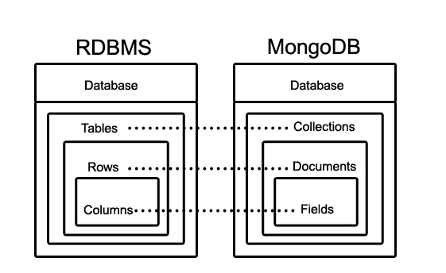
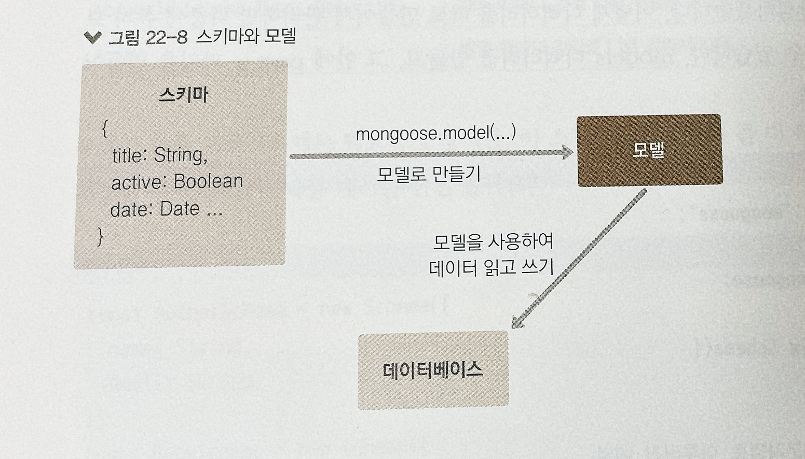
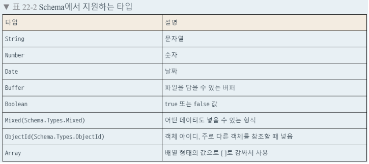

# 22. mongoose를 이용한 MongoDB 연동 실습
## 22.1 소개하기
기존에 자주 사용하는 RDBMS(관계형 데이터베이스)에는 몇 가지 한계가 있다.
1. 데이터 스키마가 고정적이다. 따라서 데이터 양이 많은 경우 스키마를 변경하는 작업이 매우 번거로워질 수 이싸.
2. 확장이 어렵다. 처리해야 할 데이터양이 늘어나면 여러 컴퓨터에 분산하는 것이 아닌 서버의 성능을 업그레이드하는 방식으로 확장해 주어야 한다.

MongoDB는 관계형 데이터베이스의 한계를 극복한 '문서 지향적인 NoSQL' 데이터베이스이다. 이 데이터베이스에 등록하는 데이터는 유동적인 스키마를 지닐 수 있고, 서버의 데이터양이 늘어나도 여러 컴퓨터로 분산하여 처리할 수 있도록 확장하기 쉽게 설계되어 있다.

### 문서란?
MongoDB에서 말하는 문서란 RDBMS의 레코드와 개념이 비슷하다. 문서의 데이터 구조는 한 개 이상의 키-값 쌍으로 되어 있다.

```
{
    "_id":ObjectId("5099803df3f49438..."),
    "username":"velopert",
    "name":{first:"M.J", last:"Kim"}
}
```

문서는 BSON(바이너리 형태의 JSON) 형태로 저장된다. 또 새로운 문서 생성시 _id라는 고윳값을 자동으로 생성하는데 이 값은 값의 고유함을 보장한다.

여러 문서가 들어 있는 곳을 '컬렉션'이라고 하고, 다른 스키마를 가지고 있는 문서들이 한 컬렉션이 공존할 수 있다.

### MongoDB 구조
하나의 서버에 데이터베이스를 여러 개 가지고 있을 수 있고, 각 데이터베이스에는 여러 개의 컬렉션이 있고, 컬렉션 내부에는 문서들이 들어있다.



### 스키마 디자인
NoSQL에서는 그냥 모든 것을 문서 하나에 넣는다. 문서 내부에 또 다른 문서를 넣을 수 있고 이를 subdocument 라고 한다.

## 22.2 MongoDB 서버 준비

## 22.3 mongoose의 설치 및 적용
mongoose는 Node.js 환경에서 사용하는 MongoDB 기반 ODM 라이브러리 이다. 데이터베이스 문서들을 자바스크립트 객체처럼 사용할 수 있게 해준다.

`yarn add mongoose dotenv` 명령어로 설치, dotenv는 환경변수들을 파일에 넣고 사용할 수 있게 하는 개발 도구이다. DB에 접속시 서버에 주소나 계정, 비밀번호가 필요할 수 있다. 이때 환경별로 달라질 수 있는 값은 코드 안에 직접
작성하는 것이 아닌 환경변수로 설정하는 것이 좋다.

### .env 환경변수 파일 생성

```javascript
//프로젝트 root 경로에 .env 파일 생성
PORT=4000
MONGO_URL=mongodb://localhost:27017/blog
```
```javascript
//src/main.js
require('dotenv').config();
const Koa = require('koa');
const Router = require('koa-router');
const bodyParser = require('koa-bodyparser');

//비구조화 할당을 통해 process.env 내부 값에 대한 레퍼런스 만들기
//Node.js에서 환경변수는 process.env 값을 통해 조회할 수 있다.
const { PORT } = process.env;

const api = require('./api');

const app = new Koa();
const router = new Router();

//라우터 설정
router.use('/api', api.routes());

//라우터 적용 전에 bodyParser 적용
app.use(bodyParser());

//app 인스턴스에 라우터 적용
app.use(router.routes()).use(router.allowedMethods());

//PORT가 지정되어 있지 않다면 4000을 사용
const port = PORT || 4000;
app.listen(port, () => {
  console.log('Listening to port %d', port);
});
```

### mongoose로 서버와 데이터베이스 연결
데이터베이스 연결시 mongoose의 connect 함수를 사용한다.

```javascript
mongoose
  .connect(MONGO_URL, { useNewUrlParser: true, useFindAndModify: false })
  .then(() => {
    console.log('Connected to MongoDB');
  })
  .catch((e) => {
    console.error(e);
  });
```
** mongoose버전 6부터 useNewUrlParser, useUnifiedTopology, useFindAndModify, useCreateIndex는 더 이상 지원되지 않는 옵션으로 
항상 useNewUrlParser, useUnifiedTopology, useCreateIndex 는  true, useFindAndModify false 처럼 작동 한다.

[참고1](https://mongoosejs.com/docs/migrating_to_6.html#no-more-deprecation-warning-options)
[참고2](https://velog.io/@lee951109/MongoDB-MongoParseError-options-usecreateindex-usefindandmodify-are-not-supported)

## 22.4 esm으로 ES 모듈 import/export 문법 사용하기
ES 모듈인 import/export 문법은 Node.js에서 아직 정식으로 지원되지 않는다. 따라서 확장자를 .mjs로 사용하고 node를 실행할 때 `--experimental-modules`라는 옵션을 넣어주어야 한다.
esm 라이브러리를 사용하여 해당 문법을 사용한다. `yarn add esm`

**노드버전 13.2 이상부터는 --experimental-modules 옵션을 사용하지 않아도 된다. 또 확장자를 .mjs로 사용하지 않아도 package.json에 설정을 통해서도 사용할 수 있다.

[참고1](https://www.zerocho.com/category/NodeJS/post/609779f29f879900043a872f)
[참고2](https://www.daleseo.com/js-node-es-modules/)

기존 src/index.js 파일은 -> main.js 로 이름을 변경하고 새로 index.js 파일을 생성한다.
```javascript
//src/index.js
//이 파일에서만 no-global-assign ESLint 옵션을 비활성화 한다.
require = require('esm')(module);
module.exports = require('./main.js');
```
```javascript
//package.json
{
  (...)
  "scripts": {
  "start": "node -r esm src",
    "start:dev": "nodemon --watch src/ -r esm src/index.js"
  }
}
```
```javascript
//.eslintrc.js
module.exports = {
  env: {
    commonjs: true,
    es6: true,
    node: true,
  },
  extends: ['eslint:recommended', 'prettier'],
  globals: {
    Atomics: 'readonly',
    SharedArrayBuffer: 'readonly',
  },
  parserOptions: {
    ecmaVersion: '2018',
    sourceType: 'module',
  },
  rules: {
    'no-unused-vars': 'warn',
    'no-console': 'off',
  },
};
```

### 기존 코드 ES Module 형태로 바꾸기
api/posts/posts.ctrl.js 파일의 exports -> export const 로 바꾼다.

기존 소스코드의 require 부분을 import 문으로 변경한다.

그리고 루트 디렉터리 안에 jsconfig.json을 작성한다.
```
{
  "compilerOptions": {
    "target": "ES6",
    "module": "ES2015"
  },
  "include": ["src/**/*"]
}
```
이렇게 하면 자동완성을 통해 원하는 모듈을 불러올 수 있어 편리하다.

## 22.5 데이터베이스의 스키마와 모델
스키마는 컬렉션에 들어가는 문서 내부의 각 필드가 어떤 형식으로 되어 있는지 정의하는 객체이다.

모델은 스키마를 사용하여 만드는 인스턴스로 실제 작업을 처리할 수 있는 함수들을 지니고 있는 객체이다.



블로그 포스트에 대한 스키마 정의, src/models/post.js 에 작성하여 관리한다.

| 필드 이름          | 데이터 타입  | 설명    |
|------------------|------------|---------|
| title            | 문자열      | 제목     |
| body             | 문자열      | 내용     |
| tags             | 문자열 배열  | 태그 목록 |
| publishedDate    | 날짜        | 작성날짜  |

```javascript
import mongoose from 'mongoose';

//스키마 생성
const { Schema } = mongoose;
const PostSchema = new Schema({
  title: String,
  body: String,
  tags: [String],
  publishedDate: {
    type: Date,
    default: Date.now,
  },
});

//모델 생성
const Post = mongoose.model('Post', PostSchema); //mongoose.model(스키마이름, 스키마객체, 원하는 컬렉션 이름)
export default Post;
```



MongoDB에서 컬렉션 이름을 만들 때 권장되는 컨벤션은 구분자를 사용하지 않고 복수 형태로 사용하는 것이다. 컨벤션을 따르고 싶지 않다면 세번째 파라미터에 원하는 이름을 입력하면 된다. 
기본적으로 데이터베이스에서 스키마 이름의 복수형태로 컬렉션 이름을 만든다. (예. 스키마 이름 : Post -> 컬렉션이름 : posts)

## 22.6 MongoDB Compass의 설치 및 적용
MongoDB Compass는 MongoDB를 위한 GUI 프로그램이다. Window의 경우 MongoDB 설치시 같이 설치된다. 